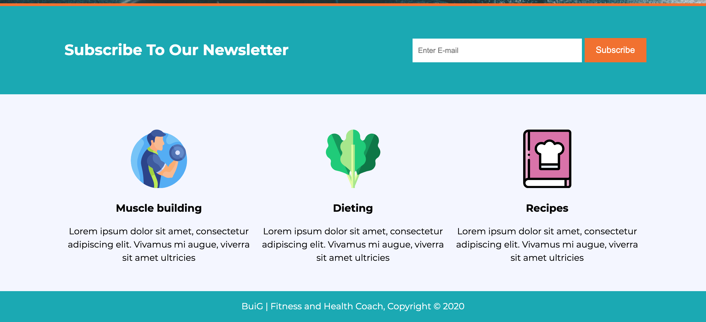
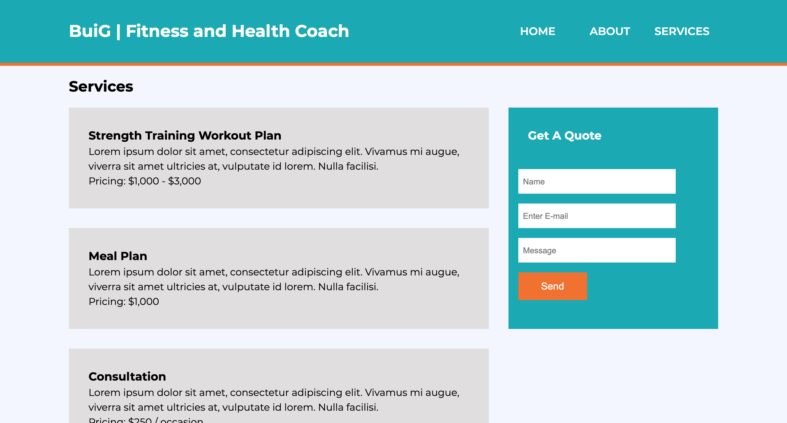

# BuiG_Fitness

Made a mobile responsive website about Fitness. Practiced core CSS components such as grid, flexbox, pseudo-classes, positioning, selectors, media queries etc...

# Demo

# Technologies Used

HTML, Plain CSS, Vanilla JS

# Problems

Grid in mobile resolution can be tricky. In the services page the boxes overflew. Fixing that took a little time, athough it was not neccessary hard. I just had to set the grid coloumn a minmax value.

# Website

https://buigabor.github.io/BuiG_Fitness/
